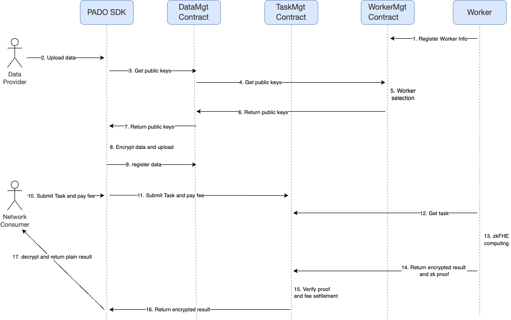
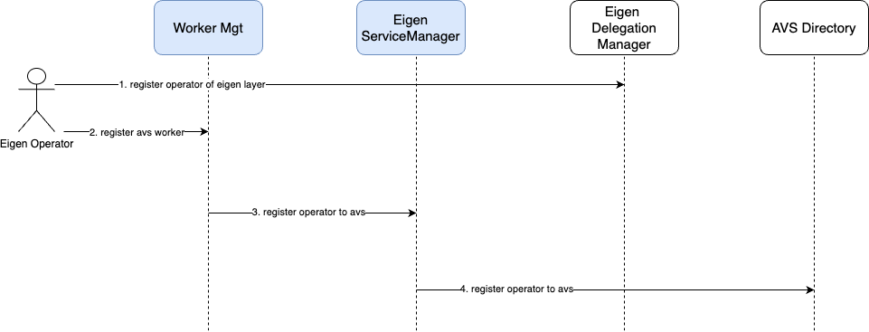
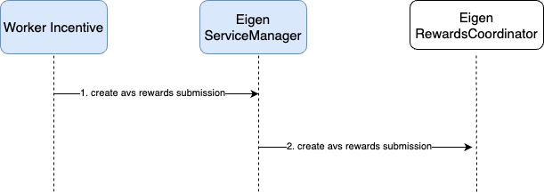

## Overview

PADO Contracts is a collection of blockchain contracts that can be deployed on multiple blockchains, including Ethereum, L2, AO, etc. The article takes solidity as an example to design contracts.

## Contrats Core Workflow

According to the architecture documentation [PADO Network Core Workflow](https://github.com/pado-labs/zkFHE-Network-Docs/blob/main/zkFHE-Network.md#core-workflow), the core workflow is divided into three types, and we will also divide the contracts workflow into three types.

### Threshold Public Key Contracts Core Workflow

### User Secret Key Contracts Core Workflow

### Multiple Public Key Contracts Core Workflow



## Common Contract

```solidity
// SPDX-License-Identifier: MIT

pragma solidity ^0.8.20;

/**
 * @notice A struct representing computing request information related to the task.
 */
struct ComputingInfoRequest {
    uint256 price; // The computing price.
    uint32 t; // Threshold t.
    uint32 n; // Threshold n.
}
```

## TaskMgt Contract

Task Management contract receive confidential computing tasks submitted by Network Consumer, Receive task-related encrypted data submitted by Data Provider , receive zkFHE computing results submitted by Worker and verify the results, and obtain pending tasks and completed tasks.

The following are the main interfaces:

```solidity
// SPDX-License-Identifier: MIT

pragma solidity ^0.8.20;

import { ComputingInfoRequest } from "./Common.sol";

/**
 * @notice A struct representing a single task.
 */
struct Task {
    bytes32 taskId; // The UID of the task.
    uint32 taskType; // The type of the task.
    bytes consumerPk; // The Public Key of the Network Consumer.
    string tokenSymbol; // The token symbol of data and computing fee.
    TaskDataInfo dataInfo; // Data information related to the task.
    ComputingInfo computingInfo; // Computing information related to the task.
    uint64 time; // The time of the task submission.
    uint8 status; // The status of the task.
    address submitter; // The submitter of the task.
    bytes code; // The task code to run, the field can empty.
}

/**
 * @notice A struct representing data information related to the task.
 */
struct TaskDataInfo {
    bytes dataEncryptionPk; // The data encryption Public Key.
    uint256 price; // The data pice.
    address[] dataProviders; // The address array of data providers related to the task.
    bytes[] data; // Data Providers provides data array. 
}

/**
 * @notice A struct representing computing information related to the task.
 */
struct ComputingInfo {
    uint256 price; // The computing price.
    uint32 t; // Threshold t.
    uint32 n; // Threshold n.
    bytes32[] workerIds; // An array of worker ids that compute the task.
    bytes[] results; // The workers' results of the task.
}

/**
 * @notice A struct representing data request information related to the task.
 */
struct TaskDataInfoRequest {
    uint256 price; // The data pice.
    string dataDescription; // Description of the data required.
    uint32 dataInputAmount; // The amount of data required.
}

/**
 * @title ITaskMgt
 * @notice TaskMgt - Task Management interface.
 */
interface ITaskMgt {
    /**
     * @notice Network Consumer submit confidential computing task to PADO Network.
     * @param taskType The type of the task.
     * @param consumerPk The Public Key of the Network Consumer.
     * @param tokenSymbol The token symbol of data and computing fee.
     * @param dataInfoRequest The data parameters of the request.
     * @param computingInfoRequest The computing parameters of the request.
     * @param code The task code to run.
     * @return The UID of the new task
     */
    function submitTask(
        uint32 taskType,
        bytes calldata consumerPk,
        string calldata tokenSymbol,
        TaskDataInfoRequest calldata dataInfoRequest,
        ComputingInfoRequest calldata computingInfoRequest,
        bytes calldata code
    ) external payable returns (bytes32);

    /**
     * @notice Data Provider submit data to task.
     * @param taskId The task id to which the data is associated.
     * @param data The content of the data can be the transaction ID of the storage chain.
     * @return True if submission is successful.
     */
    function submitTaskData(bytes32 taskId, bytes calldata data) external returns (bool);

    /**
     * @notice Worker report the computing result.
     * @param taskId The task id to which the result is associated.
     * @param result The computing result content including zk proof.
     * @return True if reporting is successful.
     */
    function reportResult(bytes32 taskId, bytes calldata result) external returns (bool);

    /**
     * @notice Get the tasks that need to be run by Workers.
     * @return Returns an array of tasks that the workers will run.
     */
    function getPendingTasks() external view returns (Task[] memory);

    /**
     * @notice Get the tasks that a Worker needs to run.
     * @param workerId The Worker id.
     * @return Returns an array of tasks that the worker will run.
     */
    function getPendingTasksByWorkerId(bytes32 workerId) external view returns (Task[] memory);

    /**
     * @notice Get completed tasks.
     * @return Returns an array of completed tasks.
     */
    function getCompletedTasks() external view returns (Task[] memory);
    
    /**
     * @notice Get a completed task.
     * @param taskId The task id.
     * @return Returns The completed task.
     */
    function getCompletedTaskById(bytes32 taskId) external view returns (Task memory);

    /**
     * @notice Set a data verification contract of a task type.
     * @param taskType The type of task.
     * @param dataVerifier The data verification contract address.
     * @return Returns true if the setting is successful.
     */
    function setDataVerifier(uint32 taskType, address dataVerifier) external returns (bool);

    /**
     * @notice Set a result verification contract of a task type.
     * @param taskType The type of task.
     * @param resultVerifier The result verification contract address.
     * @return Returns true if the setting is successful.
     */
    function setResultVerifier(uint32 taskType, address resultVerifier) external returns (bool);
}
```

## WorkerMgt Contract

Worker Management Contract include Worker registration and staking, updating Worker information, obtaining Worker information, Worker exiting PADO Network, selecting Workers to run the task, getting task workers and data encryption public key.

PADO Network contains two types of workers. One is the native worker registered by calling the register method of the Worker Management Contract. And the other is the EigenWorker registered by calling the registerEigenOperator method of the Worker Management Contract based on the EigenLayer framework, the EigenWorker is the operator of EigenLayer and is registered with the PADO Network AVS, for details, please refer to [register EigenLayer operator to PADO Network AVS](# Register operator to avs).

The following are the main interfaces:

```solidity
// SPDX-License-Identifier: MIT

pragma solidity ^0.8.20;

import { ComputingInfoRequest } from "./Common.sol";

/**
 * @notice A struct representing a worker.
 */
struct Worker {
    bytes32 workerId; // The UID of the worker.
    uint8 workerType; // The type of the worker.
    string name; // The worker name.
    string desc; // The worker description.
    uint256 stakeAmount; // The stake amount of the worker.
    address owner; // The worker owner.
    bytes publicKey; // The worker public key.
    uint64 time; // The worker registration time.
    uint8 status; // The current status of the worker.
    uint64 sucTasksAmount; // The number of successfully executed tasks.
    uint64 failTasksAmount; // The number of failed tasks.
}

/**
 * @title IWorkerMgt
 * @notice WorkerMgt - Worker Management interface.
 */
interface IWorkerMgt {
    /**
     * @notice Worker register.
     * @param name The worker name.
     * @param desc The worker description.
     * @param taskTypes The types of tasks that the worker can run.
     * @param publicKey The worker public key.
     * @param stakeAmount The stake amount of the worker.
     * @return If the registration is successful, the worker id is returned.
     */
    function register(
        string calldata name,
        string calldata desc,
        uint32[] calldata taskTypes,
        bytes calldata publicKey,
        uint256 stakeAmount
    ) external payable returns (bytes32);

    /**
     * @notice Register EigenLayer's operator.
     * @param operatorSignature The signature, salt, and expiry of the operator's signature.
     */
    function registerEigenOperator(
        ISignatureUtils.SignatureWithSaltAndExpiry memory operatorSignature,
        uint32[] calldata taskTypes,
        bytes calldata publicKey
    ) external;

    /**
     * @notice TaskMgt contract request selecting workers which will run the task.
     * @param taskId The task id.
     * @param taskType The type of the task.
     * @param computingInfoRequest The computing info about the task.
     * @return Returns true if the request is successful.
     */
    function selectTaskWorkers(
        bytes32 taskId,
        uint32 taskType,
        ComputingInfoRequest calldata computingInfoRequest
    ) external returns (bool);

    /**
     * @notice Get workers which will run the task.
     * @param taskId The task id.
     * @return Returns the array of worker id.
     */
    function getTaskWorkers(bytes32 taskId) external view returns (bytes32[] memory);

    /**
     * @notice Get data encryption public key of the task.
     * @param taskId The task id.
     * @return Returns data encryption public key.
     */
    function getTaskEncryptionPublicKey(bytes32 taskId) external view returns (bytes memory);

    /**
     * @notice Update worker info.
     * @param name The worker name, name can't be updated.
     * @param desc The new value of description you want to modify, empty value means no modification is required.
     * @param taskTypes The new value of taskTypes, the array length 0 means no modification is required.
     * @return Returns true if the updating is successful.
     */
    function update(
        string calldata name,
        string calldata desc,
        uint32[] calldata taskTypes
    ) external returns (bool);

    /**
     * @notice Delete worker from network.
     * @param name The name of the worker to be deleted.
     * @return Returns true if the deleting is successful.
     */
    function deleteWorker(string calldata name) external returns (bool);

    /**
     * @notice Get worker by id.
     * @param workerId The worker id.
     * @return Returns the worker.
     */
    function getWorkerById(bytes32 workerId) external view returns (Worker memory);

    /**
     * @notice Get worker by name.
     * @param workerName The worker name.
     * @return Returns the worker.
     */
    function getWorkerByName(string calldata workerName) external view returns (Worker memory);

    /**
     * @notice Get all workers.
     * @return Returns all workers.
     */
    function getWorkers() external view returns (Worker[] memory);

    /**
     * @notice User delegate some token to a worker.
     * @param workerId The worker id to delegate.
     * @param delegateAmount The delegate amount.
     * @return Returns true if the delegating is successful.
     */
    function delegate(bytes32 workerId, uint256 delegateAmount) external payable returns (bool);

    /**
     * @notice User cancel delegating to a worker.
     * @param workerId The worker id to cancel delegating.
     * @return Returns true if the canceling is successful.
     */
    function unDelegate(bytes32 workerId) external returns (bool);

    /**
     * @notice Get Workers by delegator address.
     * @param delegator The delegator address.
     * @return Returns all workers id of the user delegating.
     */
    function getWorkersByDelegator(address delegator) external view returns (bytes32[] memory);

    /**
     * @notice Get delegators by worker id.
     * @param workerId The worker id.
     * @return Returns all delegators address of the worker having.
     */
    function getDelegatorsByWorker(bytes32 workerId) external view returns (address[] memory);
}
```

## FeeMgt Contract

Fee Management Contract Settles the Network Consumer's fee to the Data Provider and Worker.

The following are the main interfaces:

```solidity
// SPDX-License-Identifier: MIT

pragma solidity ^0.8.20;

/**
 * @notice A struct representing a fee token symbol and address.
 */
struct FeeTokenInfo {
    string symbol; // Fee token symbol.
    address tokenAddress; // Fee token address.
}

/**
 * @title IFeeMgt
 * @notice FeeMgt - Fee Management interface.
 */
interface IFeeMgt {
    /**
     * @notice TaskMgt contract request settlement fee.
     * @param taskId The task id.
     * @param taskResultStatus The task run result status.
     * @param submitter The submitter of the task.
     * @param tokenSymbol The fee token symbol.
     * @param computingPrice The computing price of the task.
     * @param workerOwners The owner address of all workers which have already run the task.
     * @param dataPrice The data price of the task.
     * @param dataProviders The address of data providers which provide data to the task.
     * @return Returns true if the settlement is successful.
     */
    function settle(
        bytes32 taskId,
        uint8 taskResultStatus,
        address submitter,
        string calldata tokenSymbol,
        uint256 computingPrice,
        address[] calldata workerOwners,
        uint256 dataPrice,
        address[] calldata dataProviders
    ) external returns (bool);

    /**
     * @notice Add the fee token.
     * @param tokenSymbol The new fee token symbol.
     * @param tokenAddress The new fee token address.
     * @return Returns true if the adding is successful.
     */
    function addFeeToken(string calldata tokenSymbol, address tokenAddress) external returns (bool);

    /**
     * @notice Get the all fee tokens.
     * @return Returns the all fee tokens info.
     */
    function getFeeTokens() external view returns (FeeTokenInfo[] memory);

    /**
     * @notice Determine whether a token can pay the handling fee.
     * @return Returns true if a token can pay fee, otherwise returns false.
     */
    function isSupportToken(string calldata tokenSymbol) external returns (bool);
}
```

## Worker Incentive Contract

Responsible for the calculation of reward and penalty funds, providing rewards to honest and stable Workers and penalties to dishonest and unstable Workers.

The following are the main interfaces:

```solidity
// SPDX-License-Identifier: MIT

pragma solidity ^0.8.20;

/**
 * @title IWorkerIncentive
 * @notice WorkerIncentive - Worker Incentive interface.
 */
interface IWorkerIncentive {
    /**
     * @notice Incentive workers and their delegators.
     * @return Returns true if the incentive is successful.
     */
    function incentive() external returns (bool);

    /**
     * @notice Incentive workers and their delegators.
     * @return Returns true if the incentive is successful.
     */
    function userWithdraw() external returns (bool);

    /**
     * @notice Get a user incentive reward balance.
     * @param userAddress The user address.
     * @return Returns the user incentive reward balance.
     */
    function userRewardBalance(address userAddress) external view returns (uint256);
}
```

## DataMgt contract
This contract manage the data uploaded by data provider.

```solidity
// SPDX-License-Identifier: MIT

pragma solidity ^0.8.20;
/**
 * @notice A struct representing a concrete price of a piece of data
 */
struct PriceInfo {
    string tokenSymbol; // The token symbol of price
    uint256 price;  // The price of data 
}

/**
 * @notice A struct representing a piece of data
 */
struct DataInfo {
    bytes32 dataId; // The identifier of the data
    string dataTag; // The tag of the data
    PriceInfo priceInfo; // The price of the data
    bytes dataContent; // The content of the data
    uint64 registeredTimestamp; // The timestamp at which the data was registered
    address owner; // The owner of the data
    bool deleted; // Whether the data is deleted
}

/**
 * @notice A struct representing a piece of data
 */
struct EncryptionSchema {
    uint32 t; // threshold
    uint32 n; // total amount of nodes
}

/**
 * @title IDataMgt
 * @notice DataMgt - Data Management interface.
 */
interface IDataMgt {
    /**
     * @notice Data Provider prepare to register confidential data to PADO Network.
     * @param encryptionSchema EncryptionSchema
     * @return registryId and publicKeys Registry id and public keys
     */
    function prepareRegistery(
        EncryptionSchema calldata encryptionSchema
    ) external returns (bytes32 registryId, bytes[] memory publicKeys);

    /**
     * @notice Data Provider register confidential data to PADO Network.
     * @param registryId Registry id for registry, returned by prepareRegistry.
     * @param dataTag The tag of data, providing basic information about data.
     * @param priceInfo The price infomation of data.
     * @param dataContent The content of data.
     * @return The UID of the data
     */
    function register(
        bytes32 registryId,
        string calldata dataTag,
        PriceInfo calldata priceInfo,
        bytes calldata dataContent
    ) external returns (bytes32);
    

    /**
     * @notice Get all data registered by Data Provider
     * @param includingDeleted Whether return the deleted data
     * @return return all data
     */
    function getAllData(
        bool includingDeleted
    ) external view returns (DataInfo[] memory);

    /**
     * @notice Get data by owner
     * @param includingDeleted Whether return the deleted data
     * @param owner The owner of data
     * @return return data owned by the owner
     */
    function getDataByOwner(
        bool includingDeleted,
        address owner
    ) external view returns (DataInfo[] memory);

    /**
     * @notice Get data by dataId
     * @param includingDeleted Whether return the deleted data
     * @param dataId The identifier of the data
     * @return return the data 
     */
    function getDataById(
        bool includingDeleted,
        bytes32 dataId
    ) external view returns (DataInfo memory);

    /**
     * @notice Delete data by dataId
     * @param dataId The identifier of the data
     */
    function deleteDataById(
        bytes32 dataId
    ) external;
}


```


## EigenLayer integration

To integrate EigenLayer, an EigenServiceManager contract that inherits the IServiceManager interface of EigenLayer will be implemented. Below is the registration and reward process of EigenLayer operator to PADO Network AVS.

### Register operator to avs

Worker Management and EigenServiceManager contracts belong to PADO Network. And Eigen DelegationManager and AVS Directory contracts belong to EigenLayer.



### Create avs rewards submission

Worker Incentive and EigenServiceManager contracts belong to PADO Network. And Eigen DelegationManager contract belongs to EigenLayer.



### EigenServiceManager contract

The following are the main interfaces:

```solidity
/**
     * @notice Creates a new rewards submission to the EigenLayer RewardsCoordinator contract, to be split amongst the
     * set of stakers delegated to operators who are registered to this `avs`
     * @param rewardsSubmissions The rewards submissions being created
     * @dev Only callabe by the permissioned rewardsInitiator address
     * @dev The duration of the `rewardsSubmission` cannot exceed `MAX_REWARDS_DURATION`
     * @dev The tokens are sent to the `RewardsCoordinator` contract
     * @dev Strategies must be in ascending order of addresses to check for duplicates
     * @dev This function will revert if the `rewardsSubmission` is malformed,
     * e.g. if the `strategies` and `weights` arrays are of non-equal lengths
     */
    function createAVSRewardsSubmission(IRewardsCoordinator.RewardsSubmission[] calldata rewardsSubmissions) external;

    // EVENTS
    event RewardsInitiatorUpdated(address prevRewardsInitiator, address newRewardsInitiator);
    
/**
     * Metadata should follow the format outlined by this example.
        {
            "name": "EigenLabs AVS 1",
            "website": "https://www.eigenlayer.xyz/",
            "description": "This is my 1st AVS",
            "logo": "https://holesky-operator-metadata.s3.amazonaws.com/eigenlayer.png",
            "twitter": "https://twitter.com/eigenlayer"
        }
     * @notice Updates the metadata URI for the AVS
     * @param _metadataURI is the metadata URI for the AVS
     */
    function updateAVSMetadataURI(string memory _metadataURI) external;

    /**
     * @notice Forwards a call to EigenLayer's DelegationManager contract to confirm operator registration with the AVS
     * @param operator The address of the operator to register.
     * @param operatorSignature The signature, salt, and expiry of the operator's signature.
     */
    function registerOperatorToAVS(
        address operator,
        ISignatureUtils.SignatureWithSaltAndExpiry memory operatorSignature
    ) external;

    /**
     * @notice Forwards a call to EigenLayer's DelegationManager contract to confirm operator deregistration from the AVS
     * @param operator The address of the operator to deregister.
     */
    function deregisterOperatorFromAVS(address operator) external;

    /**
     * @notice Returns the list of strategies that the operator has potentially restaked on the AVS
     * @param operator The address of the operator to get restaked strategies for
     * @dev This function is intended to be called off-chain
     * @dev No guarantee is made on whether the operator has shares for a strategy in a quorum or uniqueness 
     *      of each element in the returned array. The off-chain service should do that validation separately
     */
    function getOperatorRestakedStrategies(address operator) external view returns (address[] memory);

    /**
     * @notice Returns the list of strategies that the AVS supports for restaking
     * @dev This function is intended to be called off-chain
     * @dev No guarantee is made on uniqueness of each element in the returned array. 
     *      The off-chain service should do that validation separately
     */
    function getRestakeableStrategies() external view returns (address[] memory);

    /// @notice Returns the EigenLayer AVSDirectory contract.
    function avsDirectory() external view returns (address);
```

## Multi-chain design

## Gas consumption
