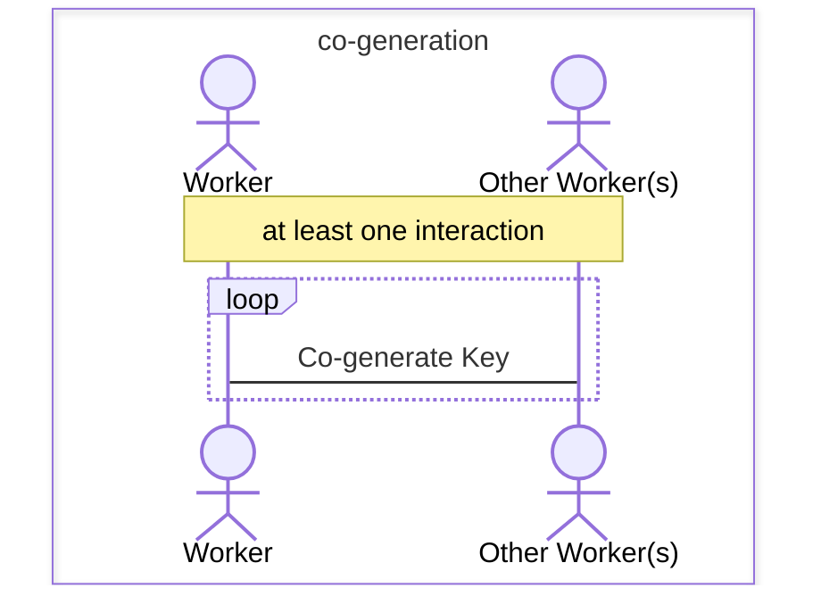
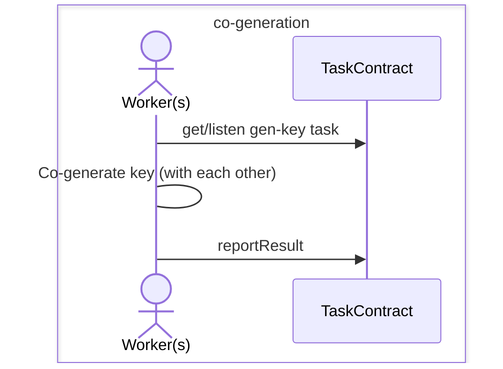
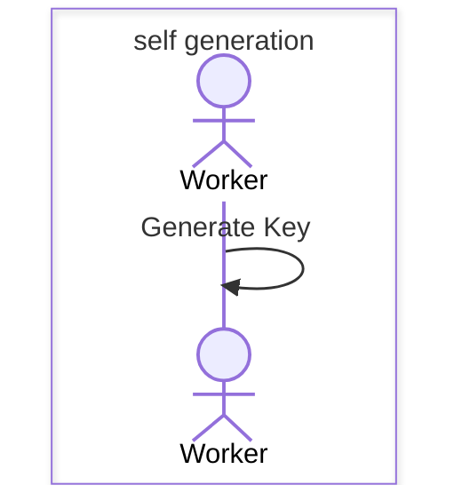
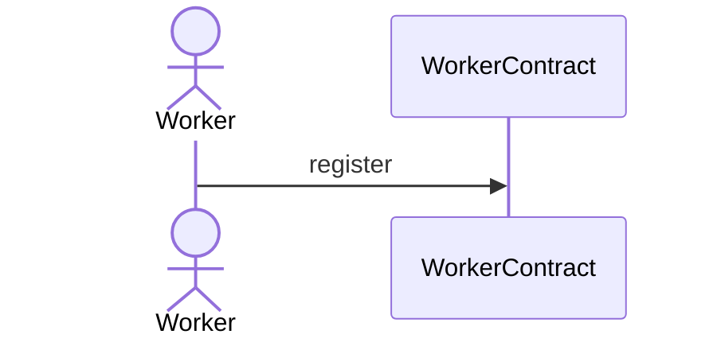
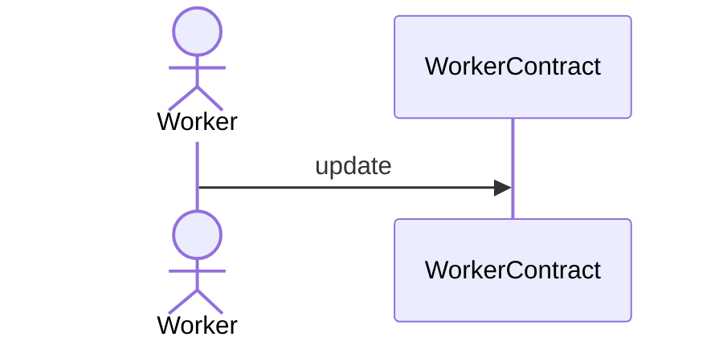
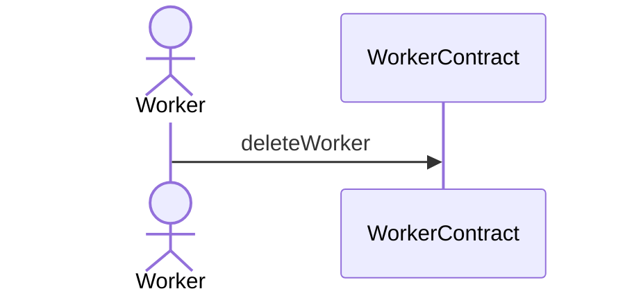
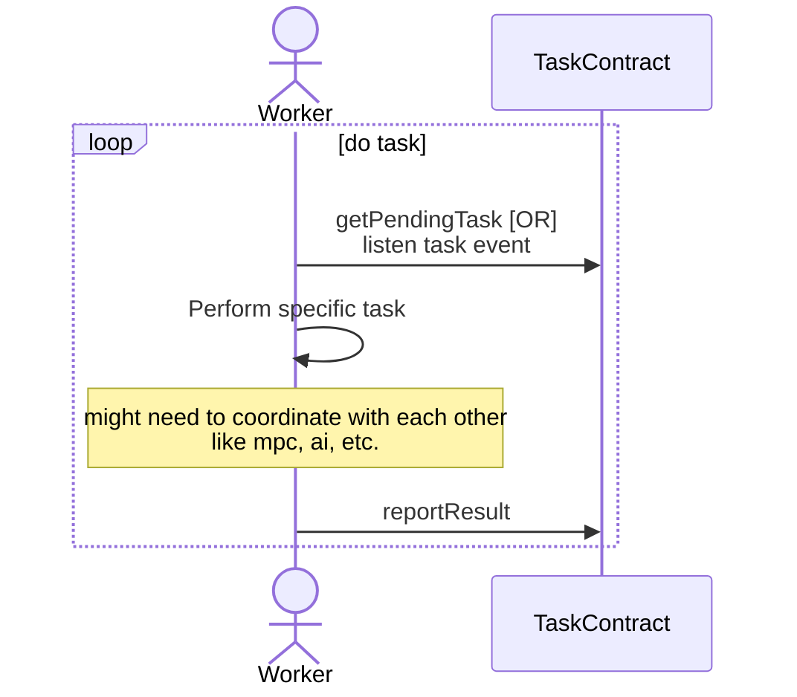
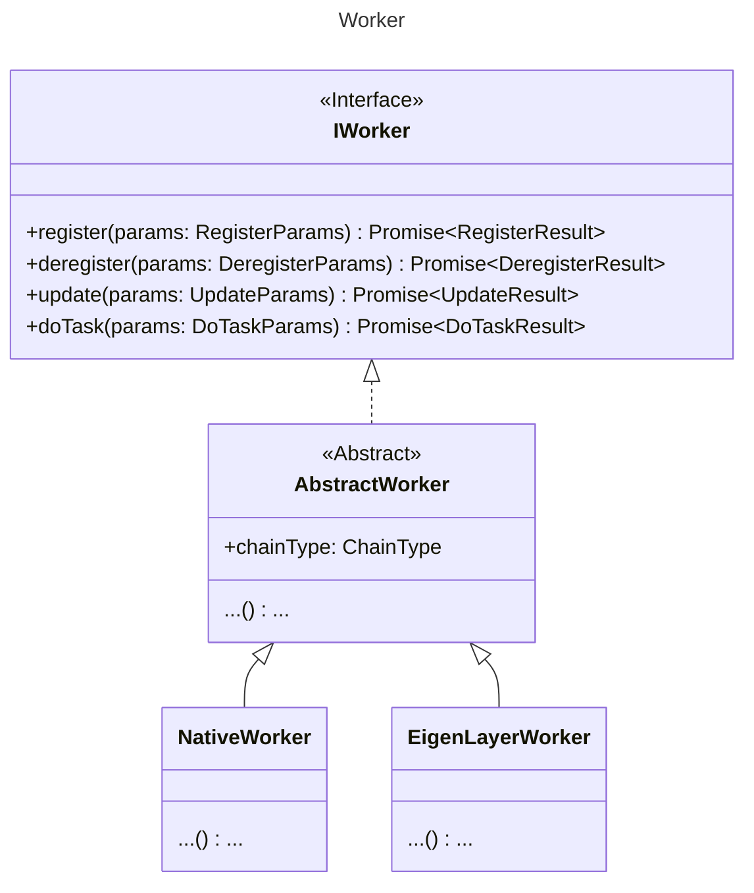

- [Overview](#overview)
- [Features](#features)
- [Key Management for Task](#key-management-for-task)
- [Task Type](#task-type)
- [Register](#register)
- [Update](#update)
- [Deregister](#deregister)
- [Do task](#do-task)
- [Multi-chain](#multi-chain)
- [Class Diagram](#class-diagram)
- [node api](#node-api)
- [Command-Line Tool](#command-line-tool)
- [TODO](#todo)

## Overview


The Worker must be registered to the Worker Management of PADO Contracts. Confidential computing tasks will only be dispatched to successfully registered Workers. The registered information includes name, description, owner address, machine resources, RPC address and port, Worker public key, etc.

The Worker who execute the task will get the task from the Task Management Contract, get the encrypted data from the Storage Blockchain if necessary, and then run the zkFHE computation while generating a computational proof. At the end of each task, upload the encrypted results and computation proofs to the Task Management Contract. 

The Task Management Contract verifies the correctness and integrity of the computation, it will trigger the Fee Management of PADO Contacts for fee settlement, and the fee will be distributed to the Data Providers and Workers corresponding to the task. At the same time, the Worker Incentive of PADO Contacts will be triggered to computation incentives for Workers.


## Features

- Multi-chain support: Ethereum mainnet, Holesky, AO, etc.
- ...


## Key Management for Task

Currently, depending on the type of task, we have three different keys:

- **Threshold Public Key**: Use the shared public generated by multiple Workers to encrypt data.
- **User Secret Key**: Use the user's own key to encrypt data.
- **Multiple Public Key**: Use the public keys of multiple Workers to encrypt data.

For Workers, just need to care `Threshold Public Key` and `Multiple Public Key`.


**Threshold Public Key**

Multiple Workers work together to generate a shared threshold public key and a secret key.





<br/>

**up-grapde**:


This is the same process as the `Do Task` later.


**Multiple Public Key**

For each Worker, locally generate a pair of public and secret keys, where the public key is used to encrypt data from Data Providers and the secret key is used to re-encrypt the Consumer's public key.




```ts
/**
 * The config for LHE Key
 */
export interface LHEKeyConfig {
    /** total number */
    n: number;
    /** threshold number */
    t: number;
}
/**
 * For LHE encryption and decryption.
 */
export declare class LHEKey {
    pk: string;
    sk: string;
    /**
     * Generate keys
     * @param config `LHEKeyConfig`
     * @returns LHEKey
     */
    static generate(config: LHEKeyConfig): LHEKey;
    /**
     * Load keys from a file.
     * @param path
     * @returns LHEKey
     */
    static load(path: string): LHEKey;
}
/**
 * @TODO
 * Other keys,
 * NOTE: for co-generation, should pass network info
 */
export declare class OtherKey {
}
/**
 *
 */
export type KeyParams = LHEKey | OtherKey;
```


## Task Type

Types of Task:
- Data sharing.
- MPC.
- AI.
- ...


The `TaskType` is used to identify the different tasks.

```ts
/**
 * @TODO
 * The task types. Such as DataSharing, MPC, AI, etc.
 */
export declare enum TaskType {
    DataSharing = 0,
    MPC = 1,
    AI = 2
}

/**
 * Need to correspond to specific task due to different task types
 */
export type TaskTypeConfig = {
    /** See `TaskType` */
    taskType: TaskType;
    /** See `KeyParams` */
    key?: KeyParams;
};
```


## Register

Before being able to do a task, one (either individual or organization) need to register as a Worker.


Types of Workers:
- Native Worker.
- EigenLayerWorker, also called Operator in EigenLayer.
- ...





**Register As EigenLayer Operator**: Reference [Operator Configuration and Registration](https://docs.eigenlayer.xyz/eigenlayer/operator-guides/operator-installation) and 
[Becoming an Operator](https://github.com/Layr-Labs/eigenlayer-contracts/blob/master/docs/core/DelegationManager.md#becoming-an-operator) to register as an Operator in EigenLayer.


```ts
/**
 * Register the worker info to WorkerContract
 */
export interface RegisterParams {
    signer: any;
    /** The name of the worker */
    name: string;
    /** The description of the worker, default is `name` */
    description?: string;
    /** Register one or more task types. See `TaskTypeConfig` */
    taskTypeConfig: TaskTypeConfig[];
}
export interface RegisterResult {
}

export interface IWorker {
    /**
     * Register Worker info into contract
     * @param params `RegisterParams`
     */
    register(params: RegisterParams): Promise<RegisterResult>;
}
```

## Update

Update description and task types of Worker.





```ts
/**
 * Update Worker description and task types by name
 */
export interface UpdateParams {
    signer: any;
    /** The name of the worker. The name can't be updated */
    name: string;
    /** The new value of the worker description */
    description?: string;
    /** The new value of taskTypes, will overwrite the original value. See `TaskTypeConfig` */
    taskTypeConfig?: TaskTypeConfig[];
}
export interface UpdateResult {
}

export interface IWorker {
    /**
     * Deregister Worker
     * @param params `DeregisterParams`
     */
    deregister(params: DeregisterParams): Promise<DeregisterResult>;
}
```

## Deregister

A worker can deregister/delete from WorkerContract by name, which have registered.




```ts
/**
 * Deregister by name
 */
export interface DeregisterParams {
    signer: any;
    /** The name of the worker */
    name: string;
}
export interface DeregisterResult {
}

export interface IWorker {
    /**
     * Update Worker info
     * @param params `UpdateParams`
     */
    update(params: UpdateParams): Promise<UpdateResult>;
}
```


## Do task


Main steps (in a loop):

- Get pending tasks or listen to events from TaskContract.
- Perform specific tasks based on task type. Note that the workers might need to coordinate with each other, such as mpc, ai, etc.
- Report the result to TaskContract with a signature.





```ts
export interface DoTaskParams {
    signer: any;
    taskTypeConfig: TaskTypeConfig[];
}
export interface DoTaskResult {
}

export interface IWorker {
    /**
     * getPendingTasks --> doTask --> reportResult
     * @param params `DoTaskParams`
     */
    doTask(params: DoTaskParams): Promise<DoTaskResult>;
}
```


## Multi-chain

The `chainType` is used to distinguish different chains. 

```ts
/**
 * The supported blockchain type.
 */
export declare enum ChainType {
    Ethereum = 0,
    Holesky = 1,
    AO = 2
}
```


## Class Diagram




For now, defined the following classes:

```ts
export declare abstract class AbstractWorker implements IWorker {
    /** `ChainType` */
    chainType: ChainType;
    abstract register(params: RegisterParams): Promise<RegisterResult>;
    abstract deregister(params: DeregisterParams): Promise<DeregisterResult>;
    abstract update(params: UpdateParams): Promise<UpdateResult>;
    abstract doTask(params: DoTaskParams): Promise<DoTaskResult>;
}
export declare class NativeWorker extends AbstractWorker {
    constructor(chainType?: ChainType);
    register(params: RegisterParams): Promise<RegisterResult>;
    deregister(params: DeregisterParams): Promise<DeregisterResult>;
    update(params: UpdateParams): Promise<UpdateResult>;
    doTask(params: DoTaskParams): Promise<DoTaskResult>;
}
export declare class EigenLayerWorker extends AbstractWorker {
    constructor(chainType?: ChainType);
    register(params: RegisterParams): Promise<RegisterResult>;
    deregister(params: DeregisterParams): Promise<DeregisterResult>;
    update(params: UpdateParams): Promise<UpdateResult>;
    doTask(params: DoTaskParams): Promise<DoTaskResult>;
}
```


Call `Worker.doTask()` or `runWorker()`? Which one is better?

```ts
/**
 *
 * @param worker
 *
 * ```js
 * const worker1 = new NativeWorker(ChainType.AO);
 * const worker2 = new EigenLayerWorker(ChainType.Holesky);
 * // worker...
 * //
 * // do some register/update ...
 *
 * //
 * runWorker(worker1);
 * runWorker(worker2);
 * // or
 * runWorker([worker1, worker2]);
 * ```
 */
export declare function runWorker(worker: IWorker | IWorker[]): Promise<void>;
```

## node api

- EigenLayer AVS node api
- Native node api

## Command-Line Tool

Provides a command-line tool for register/deregister/update/doTask.


## TODO

- Re-sharing aes key

