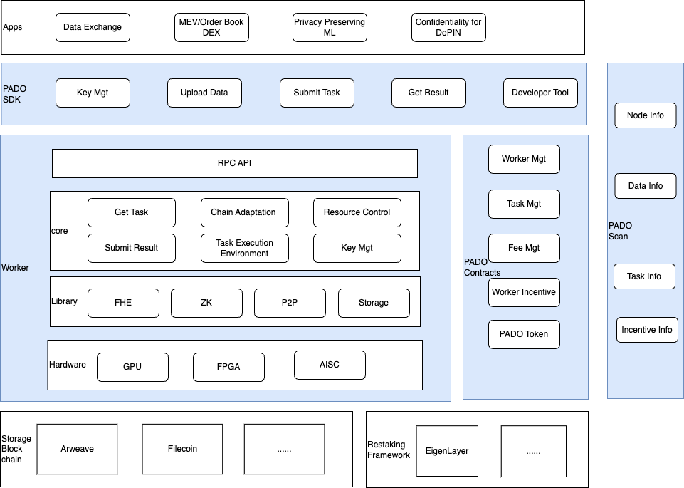
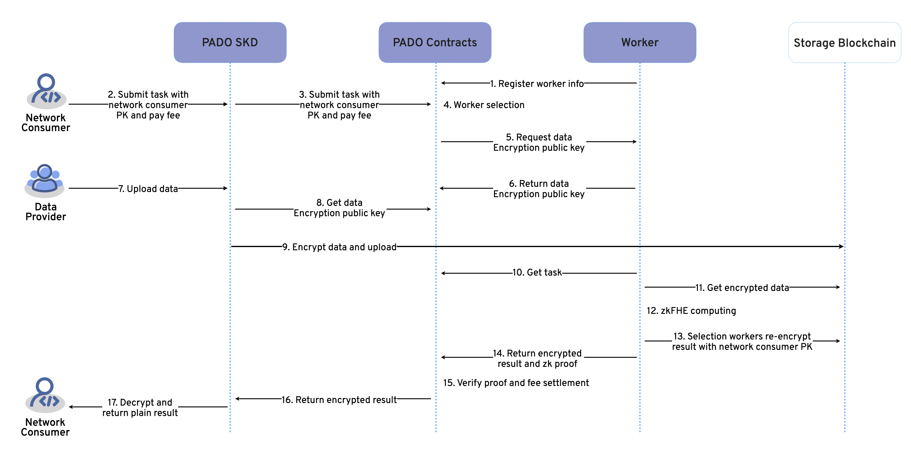
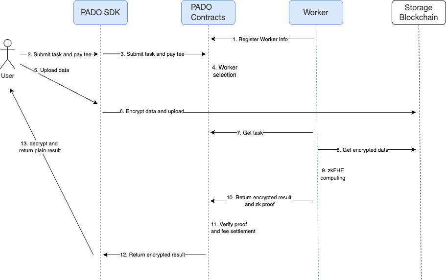
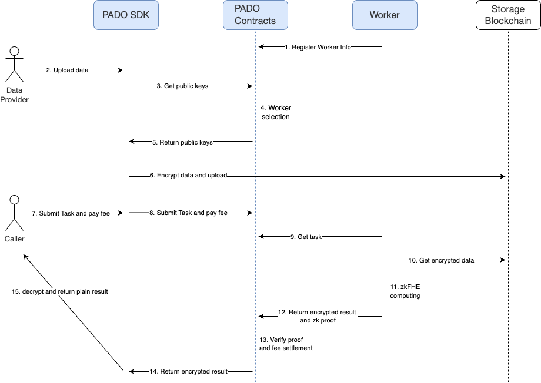

## Abstract

## Overview

The potential value of data is increasingly recognized by enterprises and individuals. People's daily behavioural data provides corrections and feedback for different technology products, creating economic value and social impact. The effective mining of data value and the avoidance of individual privacy violations as much as possible are the main pain points in the process of data monetization.

Existing systems built from either zero-knowledge proofs, multi-party computations or other privacy-enhancing techniques cannot fully resolve the paradox of privacy protection and utilization of sensitive data, and various computational issues during data processing require further reliable integrity measures.

Leveraging the benefits of traceability and programmability from blockchain-like techniques, PADO’s zkFHE protocol enables an open infrastructure for librating data value with verifiable and confidential data processes while individual and organization developers can selectively contribute with either security, functional scalability and effectivity to the network.

The core advantages of zkFHE lie in its natural abilities from both zero-knowledge proofs and fully homomorphic encryptions, to perform customizable computations on encrypted data, with the correctness guaranteed by validity proofs for the whole computation circuits. The validity proofs solids the whole computation framework with cryptographic and computational trustlessness to facilitate the necessary security requirements of applications.

## Roles in PADO Network

* **Data Provider**

  Data Provider is an individual or organization that provides computing data to PADO Network. The data from the Data Provider is encrypted by the FHE algorithm and then uploaded to decentralized storage blockchains such as Arweave and Filecoin. Data Provider can earn data fees.

* **Worker**

  Worker is a node of PADO Network, providing computing resources, running the zkFHE algorithm on encrypted data, and providing PADO Network with a confidential computing environment and resources. Worker needs to generate a zk proof while computing.

  Worker also needs to provide the Data Encryption Public Key to Data Provider to encrypt the data, and at the same time, it needs to re-encrypt the confidential computation results into results that only the Caller can decrypt.

  zkFHE confidential computing can guarantee the confidentiality and integrity of computing. Workers can earn computing fees.

  There are two types of workers: one is registered directly through PADO Network, and the other is registered to AVS of PADO Network through the restaking framework (such as Eigen Layer).

* **Caller**

  Caller is an individual or organization that uses PADO Network computing and data resources. Caller can specify the encrypted data uploaded by the Data Provider to initiate a confidential computing task and obtain the results of the confidential computing task. Callers are required to pay computing and data fees.

## Architecture

Comprehensive consideration of multiple perspectives of decentralization, security and scalability, PADO Network is designed to separate consensus and computation. Workers mainly use the zkFHE algorithm to run confidential computation and generate proofs of computation. The correctness and integrity of computation is verified through PADO Contracts using blockchain consensus. At the same time, Worker management, data management, task management, fee management, and Worker incentives included in PADO Contracts all use the consensus of the blockchain.

### Components of PADO Network

* **Worker**

  Worker is a node of PADO Network, providing computing resources, running the zkFHE algorithm on encrypted data, and providing PADO Network with a confidential computing environment and resources. Worker needs to generate a zk proof while computing.

  Worker also needs to provide the Data Encryption Public Key to Data Provider to encrypt the data, and at the same time, it needs to re-encrypt the confidential computation results into results that only the Caller can decrypt.

  zkFHE confidential computing can guarantee the confidentiality and integrity of computing. Workers can earn computing fees.

  There are two types of workers: one is registered directly through PADO Network, and the other is registered to AVS of PADO Network through the restaking framework (such as Eigen Layer).

* **PADO Contracts**

  PADO Contracts is a collection of blockchain contracts that can be deployed on multiple blockchains, including Ethereum, L2, AO, etc. PADO Contracts mainly include Worker management, data management, task management, fee management, Worker incentives, etc.

* **PADO SDK**

  PADO SDK is a collection of developer development tools. Developers can use the confidential computing capabilities of PADO Network through the SDK and develop various confidential computing applications based on PADO Network.

* **PADO Scan**

  PADO Scan is a user interface for viewing PADO Network information. PADO Scan can view Worker information, data information, task information, etc.

### Logical Architecture

The logical architecture is shown in the figure below:

#### Worker

Worker is a node of PADO Network, providing computing resources。Worker consists of the following layers：

* **Hardware**: The Hardware layer represents the supported zkFHE computing acceleration hardware. In order to improve efficiency, in addition to using the CPU for zkFHE computation, Worker will also support GPU, FPGA and AISC hardware acceleration computation.
* **Library**: The Library layer represents the basic library. The basic library mainly includes FHE and zk algorithm libraries, P2P-related network libraries, and local storage libraries used to store Worker data.
* **Core**: The Core layer represents the main functional processing module, including the following modules:
  * Get Task: Obtain confidential computing tasks from Task Management of PADO Contracts.
  * Chain Adaptation: Confidential computing tasks can be obtained from Task Management Contracts of multiple chains, and can support interaction with PADO Contracts of multiple chains.
  * Resource Control: Control the use of Worker resources when confidential computing tasks are executed.
  * Submit Result: Responsible for processing and submitting calculation results.
  * Task Execution Environment: A true zkFHE execution environment for confidential computing tasks. PADO Network supports multiple types of computing tasks and needs to support multiple different Execution Environment.
  * Key Management: Manage Worker’s public and private keys.
* **RPC API**: The RPC API layer represents the interface provided by the Worker to the outside world. You can obtain the Worker status information and manage the Worker through the interface, etc.

#### PADO Contracts

PADO Contracts is a collection of blockchain contracts that can be deployed on multiple blockchains。You can refer to [the detailed contract design](https://github.com/pado-labs/zkFHE-Network-Docs/blob/main/PADO-Contracts.md). PADO Contracts consists of the following parts:

* **Worker Management**: Worker registration and staking, updating Worker information, obtaining Worker information, and Worker exiting PADO Network.
* **Task Management:** Receive confidential computing tasks submitted by SDK, receive zkFHE computing results submitted by Worker and verify the results, and obtain pending tasks and completed tasks.
* **Fee Management:** Settle the Caller's fee to the Data Provider and Worker.
* **Worker Incentive:** Responsible for the calculation of reward and penalty funds, providing rewards to honest and stable Workers and penalties to dishonest and unstable Workers.

#### PADO SDK

PADO SDK is a collection of developer development tools. Developers can use the confidential computing capabilities of PADO Network through the SDK and develop various confidential computing applications based on PADO Network. PADO SDK consists of the following parts:

* **Key Management:** Responsible for providing zkFHE key generation and management interfaces to Data Provider and Caller.
* **Upload Data:** Responsible for encrypting Data Provider data and then uploading the encrypted data to the Storage Blockchain.
* **Submit Task:** Provide Callers with the ability to submit confidential computing tasks and pay fees.
* **Get Result:** Provide the confidential computing task results to the Caller. The Caller obtains the encrypted results and then decrypts them locally.
* **Developer Tool:** Compilation and debugging tools for developers.

#### PADO Scan

PADO Scan is a user interface for viewing PADO Network information. PADO Scan can view Worker information, data information, task information, etc.

#### Storage Blockchain

Storage Blockchain is used to store encrypted data of Data Provider, including Arweave, Filecoin, Ceramic and Greenfield, etc.

#### Restaking Framework

PADO Network supports Workers registered directly through PADO Network and also supports operators of the Restaking Framework to register to PADO Network AVS. The Restaking Framework includes EigenLayer, etc.

#### Dapps

Various ecological applications developed based on PADO SDK and PADO Contracts. Application types include Data Exchange, Decentralized Identity, MEV/Order Book DEX, Privacy Preserving ML, Confidentiality for DEPIN, etc.

### Core Workflow

According to the FHE classification of data encryption keys, FHE can be divided into the following three categories:

* Threshold FHE: Use the shared public generated by multiple Workers to encrypt data.
* Single-Key FHE: Use the user's own key to encrypt data.
* Multi-Key FHE: Use the public keys of multiple Workers to encrypt data.

Core workflow can be divided into three categories accordingly.

#### Threshold FHE Core Workflow

Threshold FHE use the shared public generated by multiple Workers to encrypt data.

The threshold FHE core workflow is shown in the figure below:

##### Register Worker

After the Worker is started, it must be registered to the Worker Management of PADO Contracts. Confidential computing tasks will only be dispatched to successfully registered Workers. The registered information includes name, description, owner address, machine resources, RPC address and port, Worker public key, etc.

##### Submit Task and Get Data Encryption Public Key

Caller can submit a confidential computing task through an application developed based on PADO SDK. Initiating a confidential computing task requires paying a certain amount of computing and data fees. When Caller initiates a task, it will pass its own Caller Public Key, and the final encrypted computation result is only the private key corresponding to the Caller Public Key can be decrypted.

Then the PADO SDK forwards the Submit Task request to the Task Management of PADO Contacts. The Task Management selects the Workers who generate the Data Encryption Public Key and the Workers who execute the task. The two Worker groups can be the same.
Then Workers return the Data Encryption Public Key to the Task Management contract.

##### Upload Data

Data Providers use PADO SDK to obtain the Data Encryption Public Key required by the task from Task Management of PADO contacts.
Then Data Providers use the FHE algorithm of PADO SDK and Data Encryption Public Key to encrypt the data and upload it to Storage Blockchain such as Arweave and Filecoin.

There may be many data providers providing data to the same task.

##### zkFHE Computing

The Workers who execute the task will get the task from the Task Management Contract, get the encrypted data from the Storage Blockchain if necessary, and then run the zkFHE computation while generating a computational proof.

##### Result Re-encrypt

The Workers who generate the Data Encryption Public Key will re-encrypt the confidential computation results using the Caller Public Key, so that only the Caller can decrypt the results.

##### Proof Verify and Fee Settlement

The Workers upload the encrypted results and computation proofs to the Task Management Contract. After the Task Management Contract verifies the correctness and integrity of the computation, it will trigger the Fee Management of PADO Contacts for fee settlement, and the fee will be distributed to the Data Providers and Workers corresponding to the task.At the same time, the Worker Incentive of PADO Contacts will be triggered to computation incentives for Workers.

##### Decrypt Result

Caller will use its own private key and the FHE algorithm in the SDK to decrypt the computation results.

#### Single-Key FHE Core Workflow

Single-Key FHE use the user's own key to encrypt data.

Single-Key FHE core workflow is similar to the Threshold FHE core workflow, with the following main differences:
* The Caller and Data Provider are the same person.
* When selecting Workers, you only need to select the Workers that execute the task, not the Workers that generate the data encryption key. This is because the Single-Key FHE uses the user's own key to encrypt data.
* The Result Re-encryption process is not required because the data is encrypted using its own key.

The Single-Key FHE core workflow is shown in the figure below:

#### Multi-Key FHE Core Workflow

Multi-Key FHE use the public keys of multiple Workers to encrypt data.

Multi-Key FHE core workflow is shown in the figure below:

##### Register Worker

The Multi-Key FHE register worker process is the same as  [Threshold FHE Register Worker](#Register Worker).

##### Get Workers Public Keys and Upload Data

Data Provider submits data upload request to Task Management of PADO contracts. The Task Management selects which Workers' public keys will be used to encrypt the data, and these workers will be responsible for executing tasks based on this data.

And Data Provider uses PADO SDK to obtain the Workers' public keys required by the data upload request from Task Management of PADO contacts.

Then Data Provider use the FHE algorithm of PADO SDK and the Workers' public keys to encrypt the data and upload it to Storage Blockchain such as Arweave and Filecoin.

##### Submit Task

Caller can submit a confidential computing task through an application developed based on PADO SDK. Initiating a confidential computing task requires paying a certain amount of computing and data fees. When Caller initiates a task, it will pass its own Caller Public Key, and the final encrypted computation result is only the private key corresponding to the Caller Public Key can be decrypted.

##### zkFHE Computing

The Multi-Key zkFHE Computing process is the same as  [Threshold zkFHE Computing](#zkFHE Computing), but run different zkFHE algorithms.

##### Proof Verify and Fee Settlement

The Multi-Key FHE Proof Verify and Fee Settlement process is the same as  [Threshold FHE Proof Verify and Fee Settlement](#Proof Verify and Fee Settlement).

##### Decrypt Result

The Multi-Key FHE Decrypt Result process is the same as  [Threshold FHE Decrypt Result](#Decrypt Result).

## Economics
The functionality of blockchain-like systems is based on a combination of cryptography and economic incentives. Cryptography restricts the actions of system participants for network security. On the other hand, economic incentives motivate participants to voluntarily contribute to the network's maintenance and capabilities using their own resources.

PADO network operates as a chain-agnostic open computation layer. PADO achieves confidentiality and integrity for each computation task and input provider(s) with zkFHE and related cryptographic techniques.   

### Computation Fees

To utilize the zkFHE computation network, computation fees were paid by Callers with coins like USDT/USDC, etc. Note if a computation task involves any data inputs supplied by the data providers, the additional fees shall be added and shared by the providers according to the allocation plan specified in the task.

### Incentives

The network incentives are primarily designed to benefit computing power providers, network security, and the developer community. Beyond the computation fee for the workers and related participants, PADO network shall incentivize the network contributors to maintain the network liveness and security.

### Penalties

Actions or situations that will trigger penalties include:

- Inactive worker: Any worker that has been registered normally but was detected in an abnormal state will incur a minor penalty to compensate for the network operation cost.
- Computation failure: Workers unable to derive a valid computation result like decryption failure and proof rejection will be punished.
- Privacy breach: Attempts to decrypt any ciphertexts except the agreed upon output of a requested computation are punishable.

### Governance

These governance responsibilities involve but are not limited to the following:

- The waiting period after the worker registers.
- The waiting period after the worker resigns.
- penalties
- …

## Use Case
